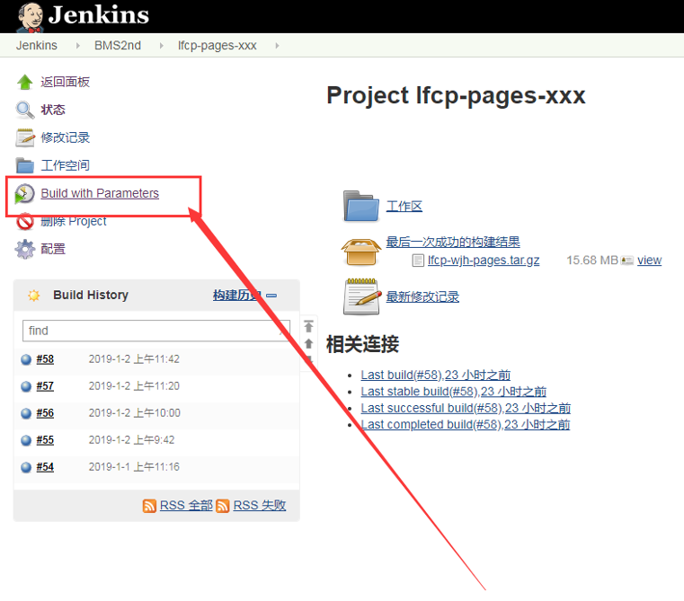
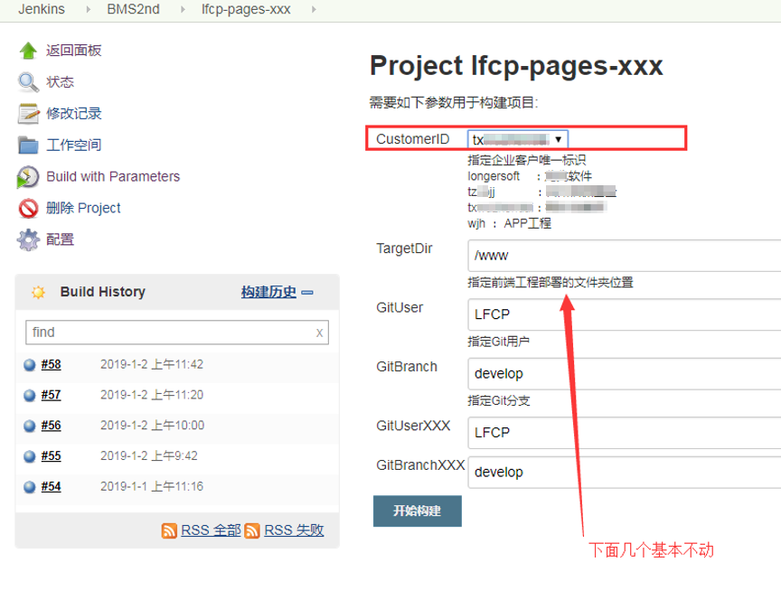

# 第 5 节 持续集成

第一次接触持续集成,是公司推敏捷流程.slogon一个接着一个,什么“可以工作的软件胜过面面俱到的文档”,还人手发了一个小本本.很多词汇现在依然耳熟能详.双周迭代、每日晨会、Sprint燃尽、敏捷岛、结对编程、user story、show case、持续集成,and so on...

运动轰轰烈烈,然而私底下,大伙都说,敏捷即裸奔,毕竟原来齐备的设计文档,不见了.

在我看来,文档形式主义,变成了,组织形式主义.仰天长啸.但是,不得不承认,每日构建、持续集成,是极其有用的.HW自己开发了一套.外面就用开源的、商用的,jekins、travis(这文档push就发布,用的就是travis),LG用的是jekins.

### 1 jekins自动部署前端工程

本节摘自《表单发布[以247为例]》.

jekins内网网址: http://192.168.1.245:8080/login,外网无法访问.用户名密码自行解决

点击“开始构建”,出现“Finished SUCCESS”构建成功.

