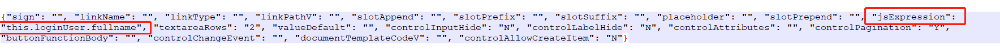

# 第 1.1 节 如何配置表单页面默认值

### 1 坑

##### 1.1 表单被不同表单组引用,且值不同时,不能配

也不算坑吧!由于系统的机制,不同的表单组,引用同一个表单,表单会重复生成.

因此,如果在不同的表单组中,表单页面具有不同的默认值,那么这个默认值就不能在这里配置.

##### 1.2 默认值只在增加时生效,且不同类型配置方法不同

###### 1.2.1 默认值填写方法-参考代码1

- 数字不能有单引号,只能有双引号
- 字符串必须有单引号,双引号中间还有单引号
- 下拉默认值要填写code,等等

###### 1.2.2 只在增加时有效-参考代码2

等等,只在增加时有效,这是对的啊?nono

**<u>核保审批过程中,到了财务经理,审批进入的是编辑页面,但实际却是新增财务信息,因此财务流水号要新生成.</u>**

###### 参考代码1

```js
//页面初始化
init(masterId){
  /** 省略无数代码 */
  if(this.types == "edit" || this.types == "view"){
    
  }else{
    /** 省略无数代码 */
    
    this.CFBIZ_BUSINESSINFO.START_DATE = (new Date()).format('yyyy-MM-dd ');
    this.CFBIZ_BUSINESSINFO.BANK_RATE = 0;
    this.CFBIZ_BUSINESSINFO.IS_EXISTING_PROJECT = 'N';
    this.CFBIZ_BUSINESSINFO.BUSINESS_NO = 'BS'+(new Date()).format('yyyyMMddHHmmssSSS');
    this.CFBIZ_BUSINESSINFO.APPROVE_STATUS = 'WTJ';
    this.CFBIZ_BUSINESSINFO.BUSINESS_TYPE='YBXZCN';
    jsInit.operatorInit(this, 'CFBIZ_BUSINESSINFO'); // 我在这里
    this.CFBIZ_BUSINESSINFO.BUSINESS_MANAGER_A = this.loginUser.fullname;
    
    /** 省略无数代码 */
  }
  
  /** 省略无数代码 */
},
```

###### 参考代码2

```js
if(this.types == "edit" || this.types == "view"){
  /****定制*****/
  if (!this.isNotEmpty(this.jsnd_charge_info.CHARGE_NO)) {
    
    this.jsnd_charge_info.CHARGE_NO = 'CHARGE'+(new Date()).format('yyyyMMddHHmmssSSS');
    
  }
  /****定制*****/
}else{
  /** 省略无数代码 */
  
  this.jsnd_charge_info.CHARGE_NO = 'CHARGE'+(new Date()).format('yyyyMMddHHmmssSSS');
  
  /** 省略无数代码 */
} 
```

##### 1.3 what do i want-参考代码

对我来讲,配置真的太麻烦了,我只想在其中贴句js代码.(放开,让我来初始化你们)

```js
jsInit.operatorInit(this, 'CFBIZ_BUSINESSINFO'); // 我在这里
```

### 2 问答

姗姗来迟的问答...哈哈哈哈

###### 问: 表单页面有默认值,怎么配

###### 答: 现在系统里单个字段如果给默认值，是在页面元素里“扩展信息”中配置

