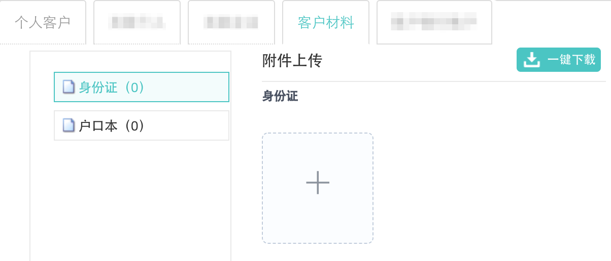
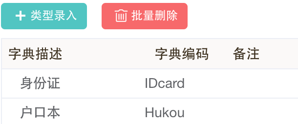
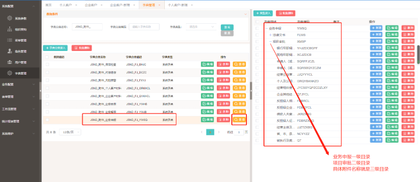
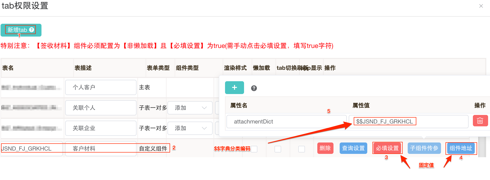

# 第 1.7 节 附件材料

附件在页面中展示效果：



**更复杂的(生成、上传、项目文档),没有配过~~~**

### 1. 配置步骤

1. 在“字典管理”菜单,配置方法同普通字典,为方便搜索,“字典分类名称”可以取名形如“XXXX\_附件_”
   - 只有一级目录如下图



​		- 多级目录如下图



​		配置完成,每个字典项点击后面的查看,就能看到详细的附件名称及目录关系

2. “表单组管理>更多操作>页签配置”,新增tab.



- 新增的tab为“自定义组件”

- “必填设置”为“true”

- “子组件传参”属性名为“attachmentDict”,属性值为“$$字典分类编码”

- 组件地址,编辑、查看都配成“@/views/businessWidgets/attachmentComponent.vue”

### 2. 附件信息备注配置

以下内容来自redmine,没配过,不确定配置常见和结果

1. 附件字典的权限配置

   表达式支持哪些配置信息

   - JS函数（该表达式是JS表达式）
   - 表单字段（格式：${物理表名.字段名}
   - 登录者信息（格式：this.loginUser.xxx）
   - 审批信息：this.processInfo.taskKey、this.approvalInfo.result.code
   - 表单组编码：formGroupCode=='XXX'

- 字典项备注配置说明

  ```json
  {
      "enabled": "JS条件表达式",  // 是否显示
      "required": "JS条件表达式", // 是否必填
      "readonly": "JS条件表达式",    // 是否只读（不可上传删除）
      "uploadRegexp": "^520.*",    // 匹配正规表达式（批量附件上传功能使用）
      },
      "provider": {                // 文档在线生成配置
          "name": "system/qiyuesuo",        // 生成提供方（system：内部模板、qiyuesuo：契约锁）
          "docCode": "DBYX_HTML",            // 模板编码
          "dataFilter": "JS条件表达式",    // 列表数据过滤表达式
          "docGenerateEnabled": {        // 文档生成按钮控制
              "jsExp": "JS条件表达式",
              "msg": "担保意向书日期或担保意向书编号不能为空"    // 提示消息
          },
          "docGetEnabled": "JS条件表达式"    // 文档获取按钮控制（契约锁接口专用）
      },
      "validate": {    // 附件校验
          "jsExp": "JS条件表达式",
          "msg": "本次生成的担保意向书未盖章" 
      }
  }
  ```

- 示例

  ```json
  {
      "enabled": "(['XEYD_LETTER','HYPL_LETTER'].indexOf(this.processInfo.taskKey)>=0) || node.attachmentNumber>0",
      "required": "['XEYD_LETTER','HYPL_LETTER'].indexOf(this.processInfo.taskKey)>=0",
      "readonly": "!(['XEYD_LETTER','HYPL_LETTER'].indexOf(this.processInfo.taskKey)>=0)",
      "uploadRegexp": "^520.*",
      },
      "provider": {
          "name": "qiyuesuo",
          "docCode": "DBYX_HTML",
          "dataFilter": "row.result=='OK'&&row.research_status!='JDRU'&&row.check_satus!='CKRU'&&row.letter_code==''",
          "docGenerateEnabled": {
              "jsExp": "(${CFBIZ_BATCH.letter_date}!=''&&${CFBIZ_BATCH.letter_date}!=null)&&(${CFBIZ_BATCH.letter_code}!=''&&${CFBIZ_BATCH.letter_code}!=null)",
              "msg": "担保意向书日期或担保意向书编号不能为空" 
          },
          "docGetEnabled": "(['XEYD_LETTER_SIGN','HYPL_LETTER_SIGN'].indexOf(this.processInfo.taskKey)>=0)" 
      },
      "validate": {
          "jsExp": "(['XEYD_LETTER_SIGN','HYPL_LETTER_SIGN'].indexOf(this.processInfo.taskKey)<0)||(['XEYD_LETTER_SIGN','HYPL_LETTER_SIGN'].indexOf(this.processInfo.taskKey)>=0&&node.attachmentList[node.attachmentList.length-1].status=='1')",
          "msg": "本次生成的担保意向书未盖章" 
      }
  }
  ```