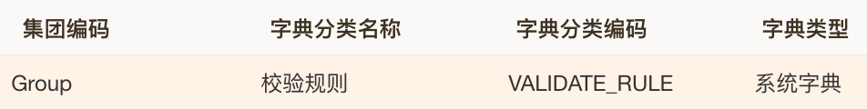
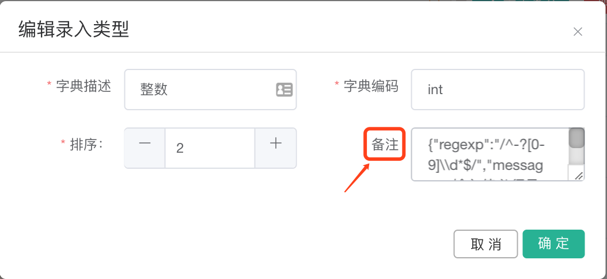
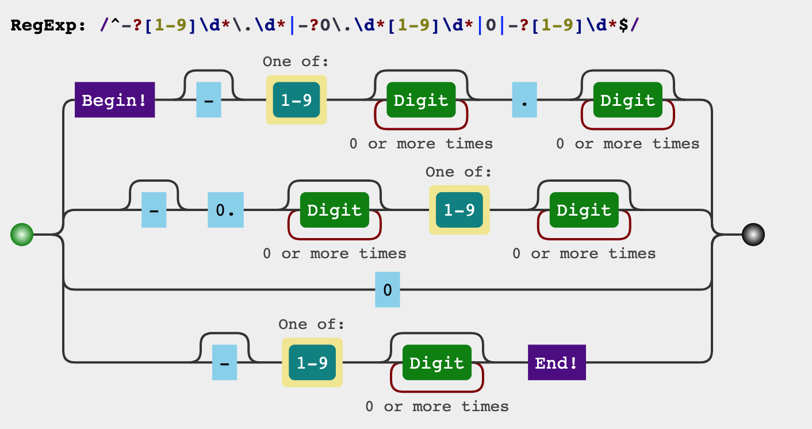

# 第 1.4 节 字典-正则校验

字典除了配置字典、[级联字典](Chapter1/dict.md)、还可以配置校验.


### 1 简述

“字典管理”默认有个“校验规则”字典,新增的校验加入其中,配置到字典项“备注”.






#####  “字典管理”校验规则变更,需要重新登录

[本条合自 第 1 节 表单组&表单配置](Chapter1/all.md)

校验规则如果变更(通过“字典管理”配置的)，需要重新登录才能生效.
因为,校验规则在登录时才能重新加载到缓存.

### 2 校验规则

本内容摘自redmine


【使用说明】

```json
{
    "regexp": "/正则表达式/", // 注意转义符号(例如：\\d)
    "jsexp": "JS条件表达式",
    "message": "提示消息",
    "enabled": "条件表达式"  // 若不指定默认为true
}
```

【示例】

```json
{
    "regexp": "/^1[0-9]{10}$/",
    "message": "必须输入有效的手机号码" 
}
```

【注意】

```json
1）jsexp和regexp只需指定其中一个（两都指定，regexp将被无视）
2）表达式支持的变量如下：
  ${VALUE}  // 表示当前字段的值
  ${物理表名.字段名} //表示引用当前表单中指定字段的值

注意：数字比较的话，必须添加“Number”转义（即：Number( ${VALUE}) > Number(${物理表名.字段名})）
```

### 3 常用正则表达式-待归纳


### 4 常用正则语法&工具

[正则图形分析](https://jex.im/regulex)能够直观的判断,正则是否正确,例如:正负整数浮点数

```
^-?[1-9]\d*\.\d*|-?0\.\d*[1-9]\d*|0|-?[1-9]\d*$
```



```
/^[1-9][0-9]{4,14}$/（用^和$指定起止位置）

1.（1~9的数字，1个）     =>   [1-9]{1}或者[1-9]

2.（0~9的数字，4~14个）  =>   [0-9]{4,14}
```

```
[abc]	查找方括号之间的任何单个字符。
[^abc]	查找任何不在方括号之间的字符。

[0-9]	查找任何从 0 至 9 的数字。
[a-z]	查找任何从小写 a 到小写 z 的字符。
[A-Z]	查找任何从大写 A 到大写 Z 的字符。
[A-z]	查找任何从大写 A 到小写 z 的字符。
[ace]*这表示，只要出现a/c/e这三个任意的字母，都会被匹配

(red|blue|green)	查找任何指定的选项。

n+	匹配任何包含 至少一个 n 的字符串。
n*	匹配任何包含 零个或多个 n 的字符串。
n?	匹配任何包含 零个或一个 n 的字符串。
n{X}	匹配包含 X 个 n 的序列的字符串。
n{X,Y}	匹配包含 X 至 Y 个 n 的序列的字符串。
n{X,}	匹配包含至少 X 个 n 的序列的字符串。

n$	匹配任何结尾为 n 的字符串。
^n	匹配任何开头为 n 的字符串。
?=n	匹配任何其后紧接指定字符串 n 的字符串。
?!n	匹配任何其后没有紧接指定字符串 n 的字符串。

[\S]表示，非空白就匹配
[\s]表示，只要出现空白就匹配


```

