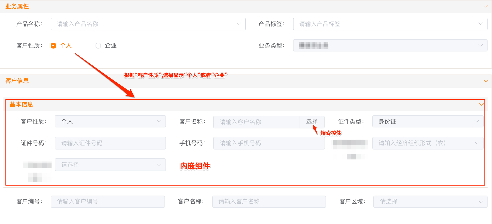
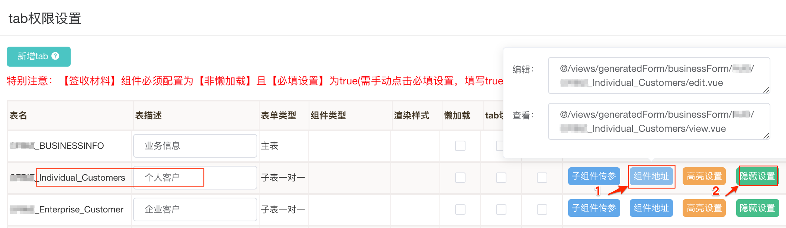
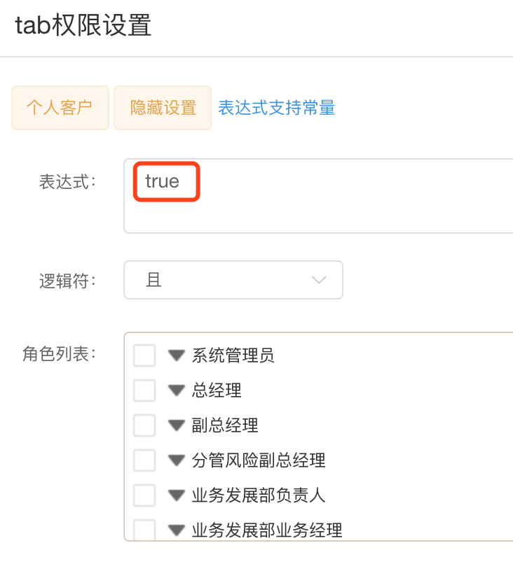
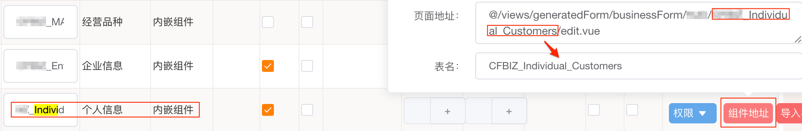

# 第 1.5 节 内嵌组件

摘自《内嵌组件配置》.

### 1 效果

内嵌组件,就是主表单中同时显示子表单,而不是页签

### 2 步骤

1. 打开表单,选择“页面元素”页签.添加“字段”,控件类型选择“内嵌组件”.

   

2. 添加之后,进入"表单组管理",找到对应表单组,点击“更多操作”.

3. 进入“更多操作=》页签配置”,需要做两件事情:

   1)  复制内嵌子表组件地址：

   找到关联的内嵌子表,然后点击后面的“组件地址”,把“编辑”中地址复制出来,如下图

   

   2) 组件隐藏设置：

   点击“隐藏设置”,在“表达式”中填写“true”,【其他项不用操作】,如下图

   

4. 再回到表单组列表,进入“更多操作=》页面配置”

   1) 在主表中找到添加的内嵌组件字段名,点击“组件地址”

   2) 把之前复制的“组件地址”粘贴到“页面地址”，表名也可从中提取粘贴

   

以上操作完成之后,重新生成表单组.