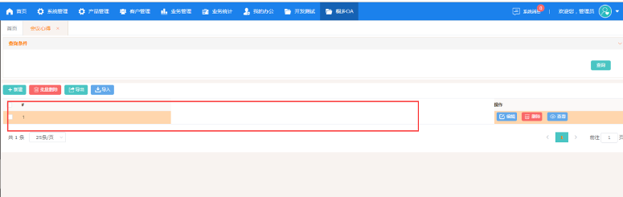
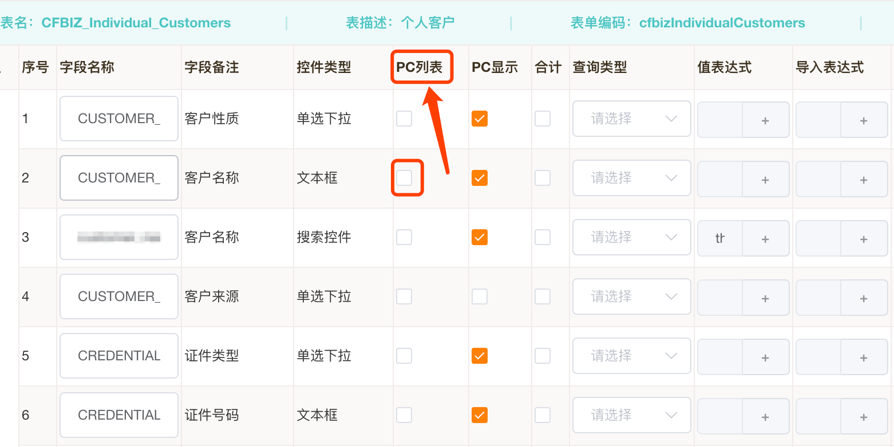

# 第 n 节 表单组生成常见问题

列表显示不全等问题,一般都需要调整表单配置,重新生成。

### 1 表单组“页面生成”按钮置灰不可用

本节摘自《表单发布[以247为例]》,我没遇到过

1. 进入表单组“更多操作=》页签配置”,弹窗中点击“确定”.

   “页面生成”按钮还不可用,继续.

2. “编辑”表单组,如果表单组只有一个表单,“表类型”必须是“主表”.

   

3. 【页面生成】选“无弹窗”——在哪呢,没找到

### 2 列表页面,只有一个“序号”字段

本节摘自《表单发布[以247为例]》.

列表字段显示缺失,遇到过多次,包括列表页面、内嵌1对多子表单.类似如下.

进入表单组页面,"更多操作=>页面配置",选中“PC列表”复选框,重新生成即可.

