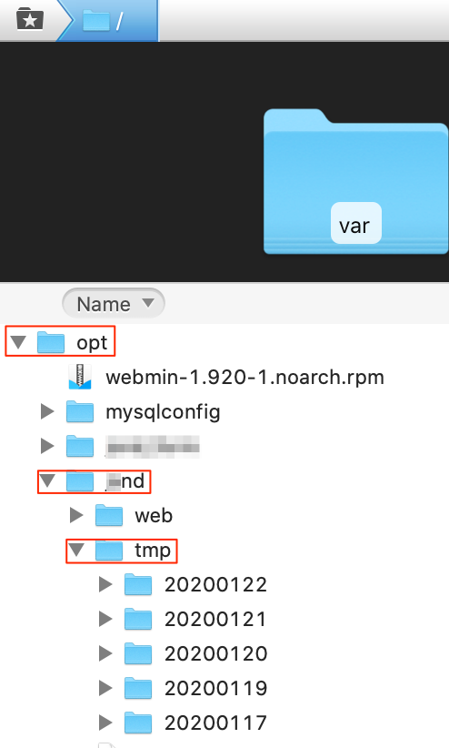
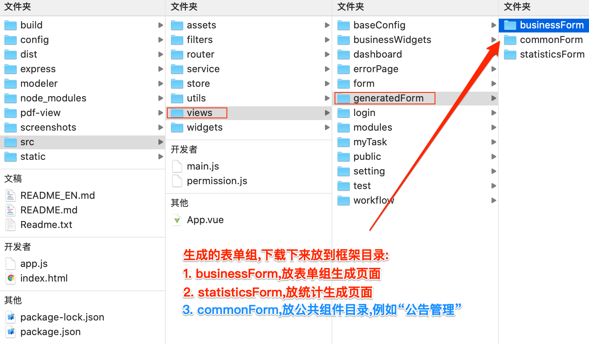

# 第 2 节 生成表单组

1. 表单组点击“页面生成”后,页面生成路径,下面只是举例.

- docker部署生成路径,例如:/opt/XXX/tmp/20200103/XXX/businessForm

- 普通部署生成路径,例如:/home/test/20200103/businessForm
- 本地Tomcat生成路径:/tomcat/bin/20200103/XXX/businessForm

2. 生成的表单组,复制粘贴到pages框架目录:/lfcp-pages2/src/views/generatedForm/

   

3. 运行前端项目.

   参考[第 2 节 运行前端项目](Chapter1/run.md)

4. 运行正常,推送到配置库.

   - 首次生成,运行正常,可直接推送到配置库(sourceTree、tortoiseGit都行),先add,后commit,再pull,再push

   - 生成过的,需要先pull,比较合并代码,再commit、push