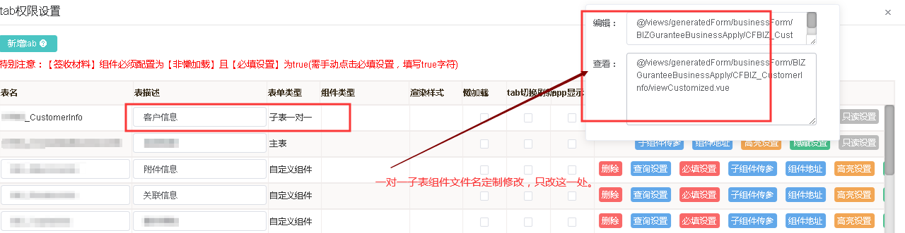
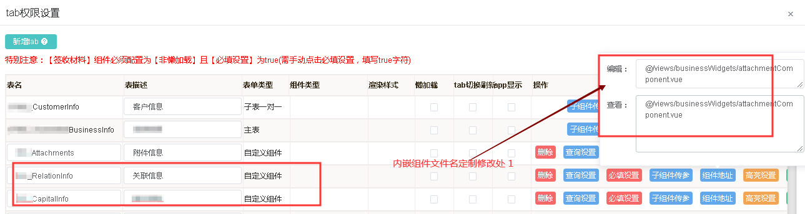
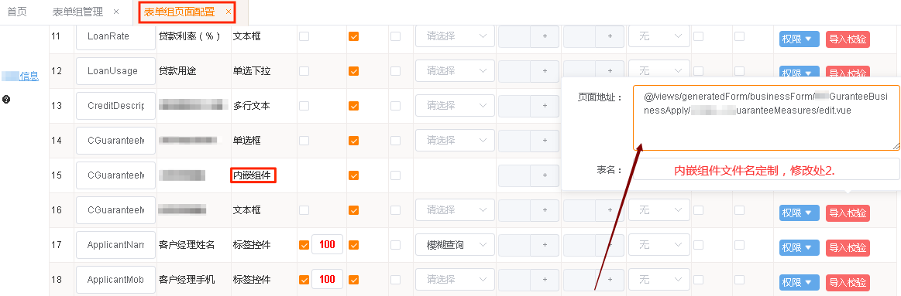
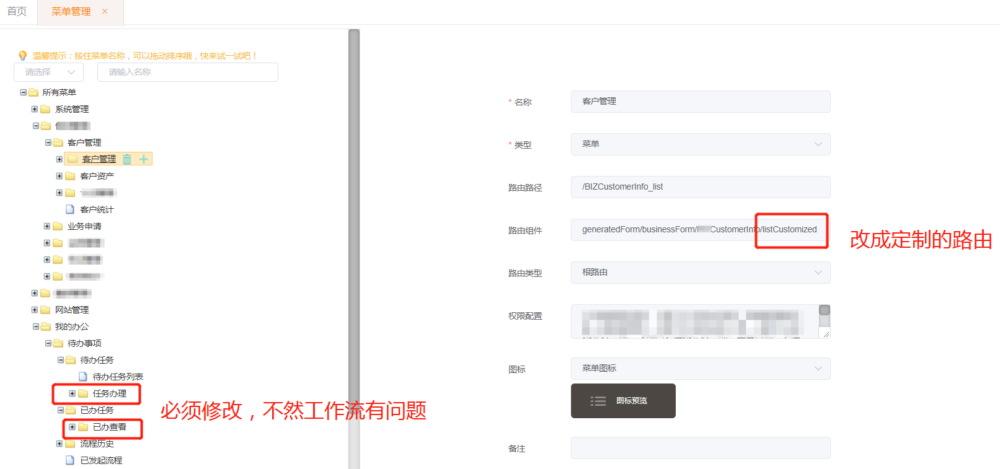

# 第 9 节 定制方法

代码写着写着总是漏了标记:(如果你能记得:)那就太好了!!!


配置变更大,需要重新生成代码.定制过的代码和生成的代码就要合并.工作量大不大另说,主要是易错!!!

工具化,重命名文件,代码行打上标记,都是避免错误的手段

##### 1 定制标记

在定制js代码前后,插入如下标记.

```js
/****定制*****/
```

在定制vue template代码前后,插入如下标记.

```html
<!--  /****定制*****/ -->
```

##### 2 定制文件改引用路径

结合[第 0 节 定制建议&表单配置](Chapter2/form_config.md)一起看

图凭印象截取,需要试试,可能不准确.总之:

A组件引用了B组件,B组件做了定制开发,为了在合代码时,能关注这个B不做直接覆盖生成,所以给B起一个和自动生成文件名不一样的名字.

随之而来,所有引用B的路由或其他组件就需要对应修改,修改后又不想手动改引用地址,使A被迫定制.相当于把修改import路径的动作配置在表单组里面,生成的时候去读取。










修改菜单路由,使用定制的文件,菜单涉及2处,不改的话,处理工作流页面表单数据带不出来:

- 菜单
- 我的任务待办及已办

