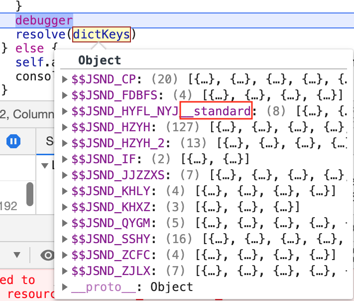
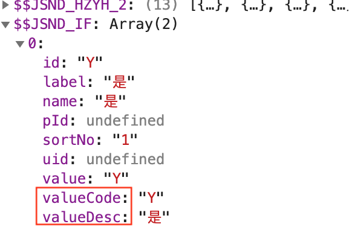

# 第 1 节 定制建议&表单配置

只能写注意事项了.临时决定加这一节的.

### 1 定制建议

定制建议,合代码合的天昏地暗时,来自zcz和wjl侠客:

**项目总共只有1-2个月,那就忍滚狠三步走起**

1. 头1-2个月尽量都用配置覆盖生成,实在不能配置的就定制开发,加上注释备注.(参考[第 9 节 定制方法](Chapter2/customized.md),或者自己发明)

   a.定制代码量如果较多建议写自定义组件后引入.

     1）定制开发涉及的文件复制一份并重命名为：add/edit/view+Customized，修改都在定制文件进行

      2）每次生成代码，复制到本地，和上次生成的页面进行对比（add、edit、list、view等），找出差异，并复制到定制的文件

     3）定制文件和生成文件同时提交git，运行采用定制文件，生成的原始文件用于下次生成对比用

   b.改名之后记得改菜单路径，同时改引用路径，引用路径也是改配置.

   c.之后遇加后缀的文件就比较新生成页面且保留定制部分,其他无后缀页面不做比较检查后覆盖提交.

2. 上线前1-2个月，直接基于文件修改，少使用表单配置生成，即使生成页面，也不能直接覆盖，要比较后加入生成的代码。

3. 核心业务逻辑。

   目前基础工程配置出来的性能有问题，现在建议做定制开发。

### 2 表单配置

1. 比表单配置更重要的.

   **约定字段中文名、英文名规范.否则就乱套.**

2. version字段不能有小数位，系统内部被转换成int

   本人经常使用1.00这样的版本号,所以一开始给弄了个.

   首先呢,和产品版本不是一个概念.后来才知道是数据版本.

   其次呢,调试得知,系统内部被转换成int了,其他类型都会报错.

3. 字符串长度建议根据实际情况来,不然报错.

```
data: "表单字段值长度超出系统设置50个字符:LOAN_CONTRACT_NO=灌农商行32190815高保个借字[09]第01号、灌农商行32190815高保个借字[09]第02号"
```

4. 看到省市区后端字典,我想说:

固定数据的字典不一定要在后台配置,前端配置更节约性能.想象省市区级联数据全部来自后端.那传输量惊人呢.

本人整了个前端地区控件,但是自动生成还有点弱.有些属性得手工改:(

5. 当字典有级连结构时,字典名称后面会增加standard,当然也可以获取没有standard的,只是这个字典没有级连结构.

**级连结构在数据库存储成[‘’,’’,’’]数组**,例如

```
[["320000_江苏省","321100_镇江市","321182_扬中市"],["320000_江苏省","321100_镇江市","321183_句容市"]]
```


- 级联与非级联



- 字典数据结构

