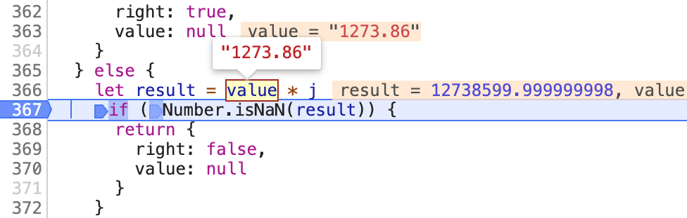
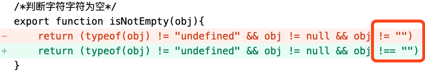

# 第 3 节 插播一条JS广告

JS易错点广而告之!!!

- 重要,我被JS **数字字符串** 折磨疯了.以后,比较数字大小,我一定在左右两边就 *1,Number()我都嫌麻烦

- 类型是字符串的[数字]乘以数字结果是数字.[真的字符串]乘以数字结果是NaN,NaN（Not A Number）通过typeof判断是个数字

  这句很绕,但请记住,不要试图通过运算结果去判断原始字符串是否是数字.

- 判断null或者undefined时**——代码截图**
  - 如果使用X==null,X是null或者undefined,等式都能成立
  - 如果使用X===null,等式不成立

- 判断空字符串时,不能用X==‘’,需要使用X===‘’**——代码截图**

  因为0==‘’,js认为相等

- 最重要的,1273.86*10000=12738600,看看JS计算的结果

  

###### 代码截图

bug给圈上.还有,第一个条件被包含在第二个条件中了!

