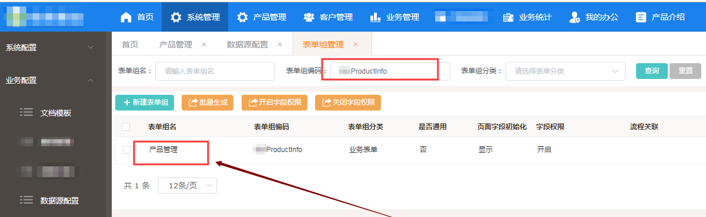
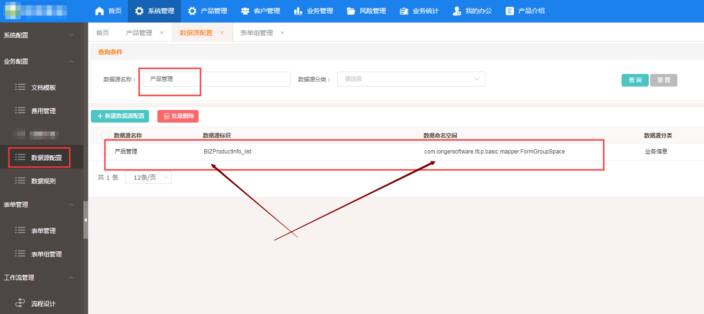
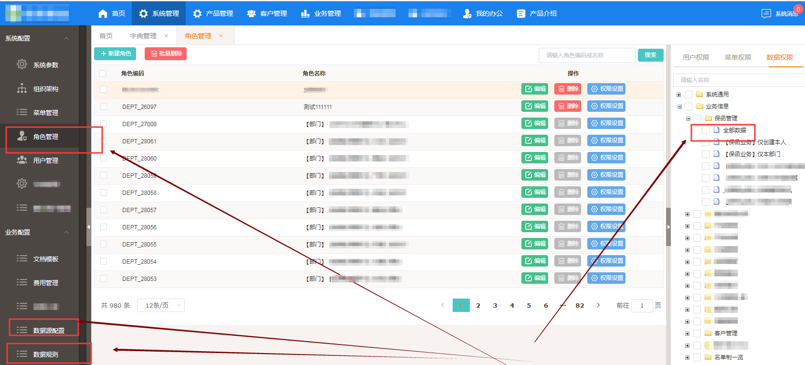

# 为何只显示列表页面,不显示列表数据?

###### 答: 权限没配全.只配置了菜单、配置了机构

### 1 坑

个人感觉,权限部分整体不太好用.原因有二:

1. “开发权限配置”(主要指统计部分)和“客户管理员配置”混杂,以至于不能够开放给客户.容易犯错.

   - 有些查询统计接口,并不使用整个页面,而只是使用接口,所有用户都要使用.

   - 有些查询统计接口,需要使用整个页面.需要控制一级公司、二级公司乃至部门的权限,包括是否可以看到下级公司、部门

2. 设计之初,并没有考虑一级二级公司、部门、角色之间的继承关系,以至于配置起来有点累.并且还有个bug,如果一个用户不属于任何组织,设置角色权限时候,就会把该用户的权限清空.内部都是先清空再设置的哦~

当然了,开发者吐槽开发者乃是大忌,毕竟没有人做的东西是完美的.吐槽别人终将被吐槽.

只是,产品设计,必须选好重点内容,设计好UI体验.等着开发者去想,不太可能,因为大家往往沉迷于实现与代码.

### 2 简述

需要配置数据源规则.

### 3 参考

1. 根据菜单上面下划线前面的表单组编码找到表单组,拿到中文表单组名字.

   找到表单组编码“XXXProductInfo”

   

   找到中文表单组名字“产品管理”

   

   

2. 根据中文表单组名字,去数据源查.

   - 查到的话配置规则.(数据源自动就加了)

   - 查不到就是没有.没有的话,可以按照这个规则自己添加一个数据源.

3. 为某列表对应的“数据源”勾选其适配的“数据规则”,而后在角色管理,进行数据源配置.

