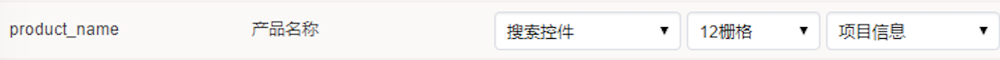
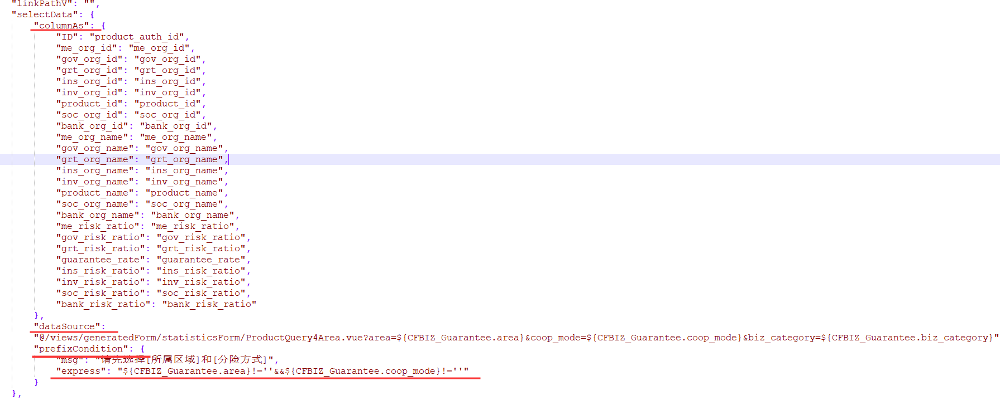

# 第 14 节 弹框控件

我没有配置过!有人问有人答,我记录了下来.效果如下.


### 1 简述

1. 选择“搜索控件”

   

2. 增加统计视图
3. 配置扩展信息
   - columnAs,左边是视图列字段名,右边是当前页字段名
   - dataSource,视图地址和查询条件
   - prefixCondition,用来加判断条件



### 2 部分配置

```json
{
	"sign": "",
	"linkName": "",
	"linkType": "",
	"linkPathV": "",
	"selectData": {
		"columnAs": {
			"ID": "product_auth_id",
			"me_org_id": "me_org_id",
			"gov_org_id": "gov_org_id",
			"grt_org_id": "grt_org_id",
			"ins_org_id": "ins_org_id",
      /** 省略一大段 */
		},
		"dataSource": "@/views/generatedForm/statisticsForm/ProductQuery4Area.vue?area=${CFBIZ_Guarantee.area}&coop_mode=${CFBIZ_Guarantee.coop_mode}&biz_category=${CFBIZ_Guarantee.biz_category}",
		"prefixCondition": {
			"msg": "请先选择[所属区域]和[分险方式]",
			"express": "${CFBIZ_Guarantee.area}!=''&&${CFBIZ_Guarantee.coop_mode}!=''"
		}
	},
	"slotAppend": "",
	"slotPrefix": "",
	"slotSuffix": "",
	"placeholder": "",
  /** 省略一大段 */
}
```


