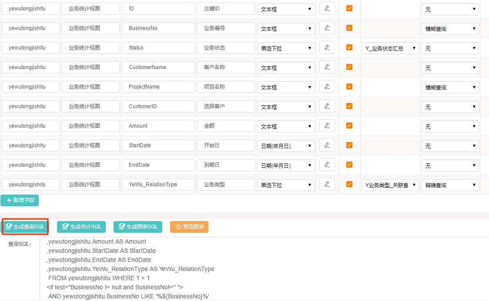

# 创建视图,是直接在数据库加,还是在系统中配?

需要的列表没有接口,可以通过统计视图(在“统计报表配置”菜单)配置出来.

### 1 注意事项

不能选到的数据库表,一般是非表单,手工填写表名和列名,也可以生效.

### 2 简述

- 添加一个统计之后,确认好列.点击**“生成查询SQL”**可以生成简单的查询SQL.或者,在"查询SQL"直接写.

- 也可以在数据库中添加好了视图,在统计配置里写查询视图

  我是这么干的,但是权限分配有点问题.(所有人可以看到所有的数据)

### 3 参考

##### 3.1 视图生成

注意:表名、字段名经过模糊处理.

```mysql
CREATE ALGORITHM=UNDEFINED DEFINER=`root`@`localhost` SQL SECURITY DEFINER VIEW `XXXX_all_customer` AS (
SELECT 
ID,
CUSTOMER_NO,
CUSTOMER_TYPE,
CUSTOMER_NATURE,
CUSTOMER_FROM,
CUSTOMER_NAME,
CREDENTIAL_TYPE,
CREDENTIAL_NO,
TEL,
null as CONTACT_ADDRESS_DETAIL,
CONTACT_ADDRESS_AREA_NAME,
INDUSTRY_NYB,
ECONOMIC_TYPE_NYB,
CUSTOMER_MANAGER,
CREATED_BY,
CREATED_TIME,
CREATED_DEPT_IDS,
CREATED_COMPANY_ID,
DELETED_TIME
from `XXXX_P_Customer` where DELETED_TIME is NULL
union all
SELECT 
ID,
CUSTOMER_NO,
CUSTOMER_TYPE,
CUSTOMER_NATURE,
CUSTOMER_FROM,
ENTERPRISE_NAME as CUSTOMER_NAME,
'YYZZ' as CREDENTIAL_TYPE,
UNIFIED_SOCIAL_CREDIT_CODE as CREDENTIAL_NO,
TEL,
CONTACT_ADDRESS_DETAIL,
CONTACT_ADDRESS_AREA_NAME,
INDUSTRY_NYB,
ECONOMIC_TYPE_NYB,
CUSTOMER_MANAGER,
CREATED_BY,
CREATED_TIME,
CREATED_DEPT_IDS,
CREATED_COMPANY_ID,
DELETED_TIME
from `XXXX_E_Customer` where DELETED_TIME is NULL
);
```


##### 3.2 参考配置

