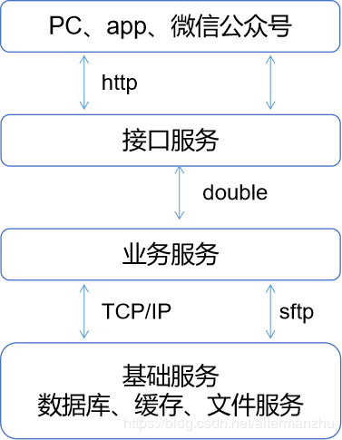

# 第 3 节 部署Docker应用

### 1 组件部署架构设计

业务系统部署,涉及mysql、redis、sftp、nginx、tomcat等组件.

规划compose时，设计为2组：

- 一组为公共组件，mysql、redis、sftp，这部分所有客户共享，资源不存在冲突，后续如果使用率高了，考虑私有化

- 另一组为私有组件，nginx、tomcat，用于部署客户应用，客户应用分为三部分：page、api和service:
  - page: vue前端页面
  - api:对外公开的接口服务，采用springmvc
  - service:系统核心服务，使用dubbo和api层通信，系统业务架构如下：



### 2 公共组件

公共组件使用common_default网络，同时对host组件暴露端口：mysql 3306、redis 6379、sftp 4023，

compose.yml如下：

```json
version: "3"
services:
  mysql:
    image: mysql
    volumes:
      - /opt/docker-common/mysql/data:/var/lib/mysql
      - /opt/docker-common/mysql/logs:/var/log/mysql
    ports:
      - "3306:3306"
    environment:
        MYSQL_ROOT_PASSWORD: "Longer.1234"
        lower_case_table_names: "1"
        TZ: Asia/Shanghai
    command: --lower_case_table_names=1
    container_name: mysql
    networks:
      - default
      
  redis:
    image: redis
    ports:
      - "6379:6379"
    environment:
       TZ: Asia/Shanghai
    command: redis-server --requirepass longer
    container_name: redis
    networks:
      - default
    
  sftp:
    image: atmoz/sftp
    volumes:
      - /opt/docker-common/sftp:/home
    environment:
       TZ: Asia/Shanghai
    ports:
      - "4023:22"
    command: mysftp:mysftp.1234:::mysftp
    container_name: sftp
    networks:
      - default
    
networks: ##定义网络组
    default:
```

启动docker之前按照compose.yml建立文件目录，然后启动docker：

```
docker-compose up -d
```

### 3 私有组件

私有组件部署客户应用:

- 一个nginx

  负责前端网站和反向代理

- 三个tomcat

  一个api，两个service负责服务，通过nginx做负载均衡

```json
version: "3"
services:
  nginx: # 服务的名称
    image: nginx
    volumes: # 文件夹映射
      - /opt/${customer_code}/nginx/html:/usr/share/nginx/html # 宿主:docker:只读  ,www目录
      - /opt/${customer_code}/nginx/conf/nginx.conf:/etc/nginx/nginx.conf # nginx配置文件
      - /opt/${customer_code}/nginx/conf/conf.d:/etc/nginx/conf.d # nginx配置文件
      - /opt/${customer_code}/logs/nginx:/var/log/nginx  #日志
      - /opt/docker-common/sftp:/var/sftp
    environment:
       TZ: Asia/Shanghai
    ports: # 端口转发 宿主:docker
      - "${web_port}:80"
    expose:
      - "80"
      - "20887"
    depends_on:
      - web1
      - web2
      - api1
    container_name: ${customer_code}-nginx
    networks:
      default:
         aliases:
          - container_nginx
 
  web1:
    image: tomcat
    volumes:
      - /opt/${customer_code}/web:/usr/local/tomcat/webapps
      - /opt/${customer_code}/logs/web1:/usr/local/tomcat/logs
      - /opt/${customer_code}/tmp:/home/test
    environment:
       JAVA_OPTS: -Dsupplements.host=supplements
       CATALINA_OPTS: -server -Xms256M -Xmx1024M -XX:MaxNewSize=256m -XX:PermSize=64M -XX:MaxPermSize=256m
       TZ: Asia/Shanghai
    expose:
      - "8080"
      - "20887"
    external_links:
      - mysql
      - redis
      - sftp
    container_name: ${customer_code}-web1
    networks:
      default:
         aliases:
          - container_web1
      docker-common_default:
    
  web2:
    image: tomcat
    volumes:
      - /opt/${customer_code}/web:/usr/local/tomcat/webapps
      - /opt/${customer_code}/logs/web2:/usr/local/tomcat/logs
      - /opt/${customer_code}/tmp:/home/test
    environment:
       JAVA_OPTS: -Dsupplements.host=supplements
       CATALINA_OPTS: -server -Xms256M -Xmx1024M -XX:MaxNewSize=256m -XX:PermSize=64M -XX:MaxPermSize=256m
       TZ: Asia/Shanghai
    expose:
      - "8080"
      - "20887"
    external_links:
      - mysql
      - redis
      - sftp
    container_name: ${customer_code}-web2
    networks:
      default:
         aliases:
          - container_web2
      docker-common_default:
 
  api1:
    image: tomcat
    volumes:
      - /opt/${customer_code}/api:/usr/local/tomcat/webapps
      - /opt/${customer_code}/logs/api1:/usr/local/tomcat/logs
    environment:
       JAVA_OPTS: -Dsupplements.host=supplements
       CATALINA_OPTS: -server -Xms256M -Xmx1024M -XX:MaxNewSize=256m -XX:PermSize=64M -XX:MaxPermSize=256m
       TZ: Asia/Shanghai
    expose:
      - "8080"
    depends_on:
      - web1
    external_links:
      - mysql
      - redis
      - sftp
    container_name: ${customer_code}-api1
    networks:
      default:
         aliases:
          - container_api1
      docker-common_default:
 
networks: ##定义网络组
  default:
  docker-common_default:
   external: true
```

按照compose.yml建立文件目录并配置nginx(nginx.conf)：

```json
#user  nobody;
user  root;
worker_processes  1;
 
#error_log  logs/error.log;
#error_log  logs/error.log  notice;
#error_log  logs/error.log  info;
 
#pid        logs/nginx.pid;
 
 
events {
    worker_connections  1024;
}
 
 
http {
    include       mime.types;
    default_type  application/octet-stream;
 
    #log_format  main  '$remote_addr - $remote_user [$time_local] "$request" '
    #                  '$status $body_bytes_sent "$http_referer" '
    #                  '"$http_user_agent" "$http_x_forwarded_for"';
 
    #access_log  logs/access.log  main;
 
    sendfile        on;
    #tcp_nopush     on;
 
    #keepalive_timeout  0;
    keepalive_timeout  65;
 
    #gzip  on;
	gzip  on;
    gzip_min_length 1k;
    gzip_buffers 4 16k;
    gzip_http_version 1.0;
    gzip_comp_level 6;
    gzip_types application/javascript application/x-javascript application/json application/font-woff text/plain text/javascript text/xml text/css image/jpeg image/jpg image/gif image/png;
    gzip_disable "MSIE [1-6]\.";
    gzip_vary on;
	include       conf.d/*.conf;
}
stream {
    log_format proxy '$remote_addr [$time_local] '
                 '$protocol $status $bytes_sent $bytes_received '
                 '$session_time "$upstream_addr" '
                 '"$upstream_bytes_sent" "$upstream_bytes_received" "$upstream_connect_time"';
	access_log /var/log/nginx/tcp_access.log proxy;
    error_log /var/log/nginx/tcp_serror.log;
	
	include       conf.d/*.tcp;
}
```

app.conf

```
upstream container-service{
    server container_web1:8080;       #server1
    server container_web2:8080;       #server1
}
upstream container-api {
    server container_api1:8080;       #server1
}
 
server {
	listen       80;
	client_max_body_size     20m;
	# server_name  somename  alias  another.alias;
 
	location / {
		root   /usr/share/nginx/html;
		index  index.html index.htm;
	}
	location /api {
		proxy_pass http://container-api/api;
		proxy_http_version 1.1;
		proxy_set_header Upgrade $http_upgrade;
		proxy_set_header Connection "upgrade";
	}
	location /service{
		proxy_pass http://container-service/service;
		proxy_http_version 1.1;
		proxy_set_header Upgrade $http_upgrade;
		proxy_set_header Connection "upgrade";
	}
	add_header Cache-Control no-store;
	add_header Pragma: no-cache;
}
```

app.tcp

```

upstream container_dubbo{
	# hash $remote_addr consistent;
	server container_web1:20888;
	server container_web2:20888;
}
 
server {
	listen 20888;
	# listen 1008 udp; 通过后面添加udp，可以进行udp的转发
	proxy_connect_timeout 10s;
    proxy_timeout 30s;
    proxy_pass container_dubbo;
}

```

### 4 设置启动和停止命令

start.sh:

```json
#!/bin/bash
export customer_code=${PWD##*/} #默认当前父目录作为客户code
export web_port=8010
docker-compose up -d
```

stop.sh

```json

#!/bin/bash
export customer_code=${PWD##*/}  #默认当前父目录作为客户code
export web_port=8010
docker-compose stop
```

后启动客户测试环境：

```
./start.sh
```

### 5 验证结果

查看容器实例：

```
docker ps
```

编写一个html文件，名称为index.html，放到nginx/html目录下

访问：http://hostip:8010

查看效果

### 后记
至此，一个PC容器化并搭建完整测试环境的过程已经介绍完，下面整理下整个过程中遇到的坑，供各位参考。

1、不同网络间容器引用、通信问题（external_links）

一开始的公共组件不是使用compose启动，而是通过docker直接启动，使用docker默认的网络bridge，在私有组件访问公共组件配置过程中，配置私有组件compose.yml、使用external_links参数配置的外部mysql等组件，一直不能实现互相连接，期间通过networks参数引入bridge，将私有组件加入该网络也不行，后来通过另外建立新的网络，不用默认的bridge解决问题，在此期间多次查阅官方文档，未能找出原因，后续只能人为规避使用默认的docker网络。

