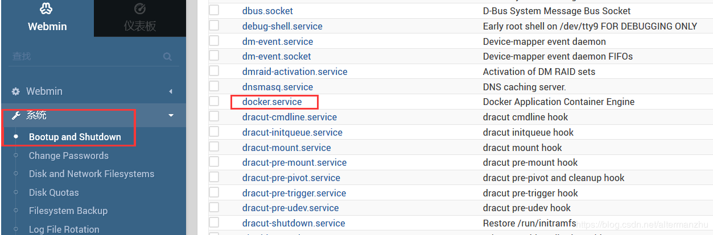
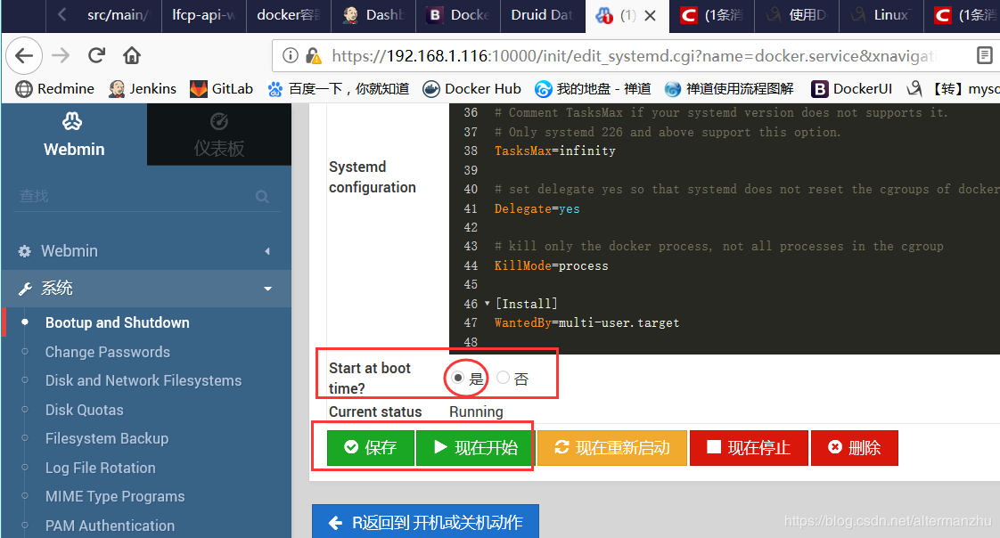

# 第 2 节 安装Docker容器
安装docker、

1 安装centos7（具体百度）

### 3 安装docker

##### 3.1 centos

参考：https://docs.docker.com/install/linux/docker-ce/centos/

1）升级依赖集配置仓库地址

```
yum install -y yum-utils device-mapper-persistent-data lvm2
yum-config-manager --add-repo https://download.docker.com/linux/centos/docker-ce.repo
```


2）安装docker-ce（开源版本）

```
yum install docker-ce docker-ce-cli containerd.io
```


3）通过webmin设置docker开机启动并启动docker





##### 3.2 ubuntu


4、安装compose

参考：https://docs.docker.com/compose/install/

1）下载compose

```
sudo curl -L "https://github.com/docker/compose/releases/download/1.24.0/docker-compose-$(uname -s)-$(uname -m)" -o /usr/local/bin/docker-compose
```


2）设置执行权限

```
sudo chmod +x /usr/local/bin/docker-compose
```

